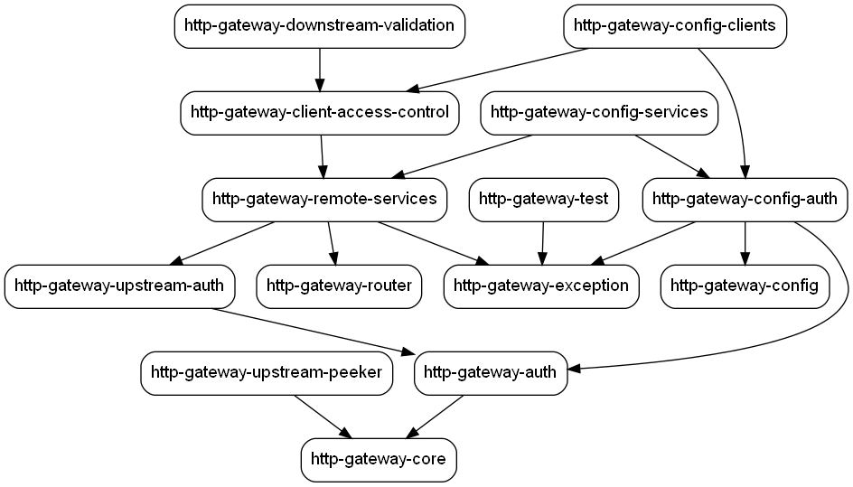

HTTP Gateway
============
HTTP Gateway is a toolkit for quickly building efficient and custom HTTP gateways running on the JVM. This library is developer oriented as it does not yet provide a configuration UI, instead it provides file based configuration connectors.

The difference between HTTP Gateway and other HTTP gateway frameworks:
- It is optimized to consume minimal RAM and CPU:
  - It can stream Go of data and thousands of requests per second with an `XMX` of `128Mo`.
  - Routes are indexed so that the algorithm to match the correct route always resolves in a complexity of `O(1)`, this means that if thousands of routes are served, it will not slow down the gateway a bit.
  - Almost all components are customizable/replaceable, so this toolkit can be used for many different use cases.

HTTP Gateway relies on other powerful open source libraries, in particular:
- [Netty](https://github.com/netty/netty)
- [Play Server](https://www.playframework.com/documentation/3.0.x/JavaEmbeddingPlay)
- [Async HTTP Client](https://github.com/AsyncHttpClient/async-http-client)
- [Config](https://github.com/lightbend/config)

HTTP Gateway is maintained by [Coreoz](http://coreoz.com/)
and licensed under [Apache License 2.0](http://www.apache.org/licenses/LICENSE-2.0).

Core concepts
-------------

Core concepts are important for proper use and understanding of the HTTP Gateway:
- **Downstream request**: An incoming HTTP request to the HTTP Gateway, made by a client
- **Upstream request**: An HTTP made by the HTTP Gateway to a service in response to a downstream request.
- **Client**: A system making HTTP requests to the HTTP Gateway
- **Service**: A system that will be made available through the HTTP Gateway

Getting started and samples
---------------------------
To build a new HTTP gateway, it is best to start looking at the [HTTP Gateway samples](samples/) to see how it all works.

Then the steps are:
1. Create a Java project, for example using the [Plume archetype](https://github.com/Coreoz/Plume-archetypes)
2. Make sure you are using at least Java 11
3. Add the HTTP Gateway Maven dependencies, in doubt, it is possible to copy the ones from the [sample HTTP Gateways pom.xml file](samples/pom.xml) 
4. Create the Gateway entry point class, it is usually easier to copy/paste a [sample gateway class](samples/src/main/java/com/coreoz/http)
5. Use and configure available [HTTP Gateway modules](#available-modules)
6. Add the configuration file, it is usually easier to copy/paste a [sample gateway config](samples/src/main/resources)

Available modules
-----------------
### Core
The [base module of HTTP Gateway](core/) which allows to proxy incoming downstream requests to upstream services.

### Router
This [router module](router/) provides routing capabilities by:
- Indexing available routes with their downstream path and their matching upstream path 
- Enabling to search in the available routes
- Calculating the upstream destination route while correctly resolving route patterns

### Authentication
This [authentication module](auth) defines objects used to store authentication data.

Available authentications are:
- API key:
  - This can be used in the configuration for clients and services using `{type = "key", value = "api-key-value"}`
  - This is used by providing the HTTP `Authorization` header with the value `Bearer api-key-value` (with the correct API key value)
- Basic:
  - This can be used in the configuration for clients and services using `auth = { type = "basic", userId = "userId-value", password = "password-value"}`
  - This is used by providing the HTTP `Authorization` header with the value `Basic base64(userId-value:password-value)` (with the correct values)

### Remote services
This [remote services module](remote-services/) provides routing and authentication capabilities to upstream services. This module relies on the [router module](#router).

#### Upstream authentication
This [upstream authentication module](upstream-auth/) provides connectors for upstream authentication. Currently, supported authentications are:
- Basic
- Key

### Upstream peeker
This [upstream peeker module](upstream-peeker/) provides the ability to peek upstream requests and responses:
- Headers
- Body

This is used by default in all [HTTP Gateway samples](samples/).

### Client access control
This [client access control module](client-access-control/) provides client authorization and route access control: so a client can only access routes that has been granted. 

### Downstream validation
This [downstream validation module](downstream-validation/) provides a validation system to unify the downstream validation process.

TODO show example to explain how to use custom values

### Config
These modules provide the HTTP Gateway setup capability where clients and services are configured in a file.
Configuration files are formatted using the [HOCON syntax](https://github.com/lightbend/config/blob/main/HOCON.md).

The modules available for configuration are:
- [Config](config/) for configuration loading.
- [Config Services](config-services/) for reading the [remote services](#remote-services) configuration.
- [Config Clients](config-clients/) for reading the [clients access control](#client-access-control) configuration.
- [Config Authentication](config-auth/) technical module for reading authentication parts for clients and services.

### Test
The [test module](test) provides a testing mock server and some utilities to make it easier:
- Writing integration tests
- Live testing of an HTTP Gateway

Modules dependency graph
------------------------

The graph can be generated with the command: `mvn com.github.ferstl:depgraph-maven-plugin:aggregate -DcreateImage=true -DreduceEdges=false -Dscope=compile "-Dincludes=com.coreoz:*" "-Dexcludes=com.coreoz:http-gateway-samples"`
This will generate the `dependency-graph.png` file in the `target` directory.

TODO
----
- [ ] Provide documentation about logging and good practices
- [ ] Implement both key and basic auth for clients and services
- [ ] upgrade play and java versions
- [ ] provide a way to easily validate downstream request body
- [ ] Add Gateway archetype
- [ ] Add a module to generate an OpenAPI spec from existing specs, see https://github.com/kpramesh2212/openapi-merger-plugin
- [ ] Add a cli to generate a service config from an OpenAPI spec 
